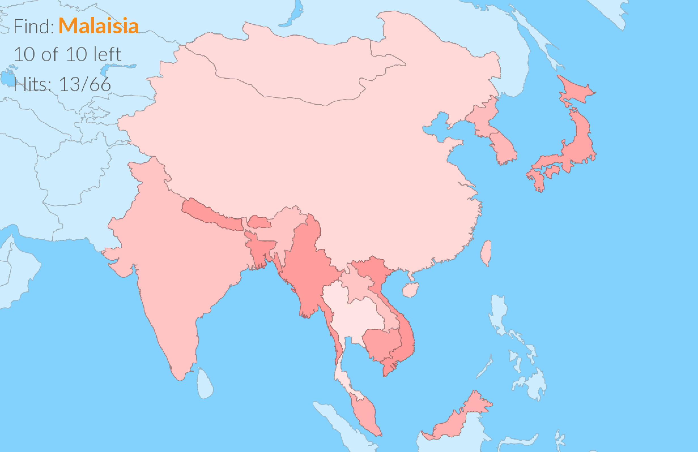

# 🎾⚽️🏐 Fun With Balls GmbH

## Countries

Countries is an educational game. The individual countries are rendered from [this open SVG from wikipedia](https://de.wikipedia.org/wiki/Datei:World_map_blank_gmt.png). A **python** script rendered out those countries to png. The game itself, done in **haxeflixel** with **haxe**, uses those to give the player a, both mental and physical, challenges.

The game is released and can be played on every interactiveSQUASH and MultiBall.

## Captain Tsubasa Game

The [Captain Tsubasa](https://de.wikipedia.org/wiki/Captain_Tsubasa) Game was made for an Saudi Arabian Anime Expo. See the mangas creator [Yōichi Takahashi](https://de.wikipedia.org/wiki/Yōichi_Takahashi) enjoy it here:

<video width="100%" autoplay controls loop>
  <source type="video/mp4" src="ressources/takahashi.mp4">
</video>

The game was done in **Godot** with the original elements from the Captain Tsubasa 2018 Series.