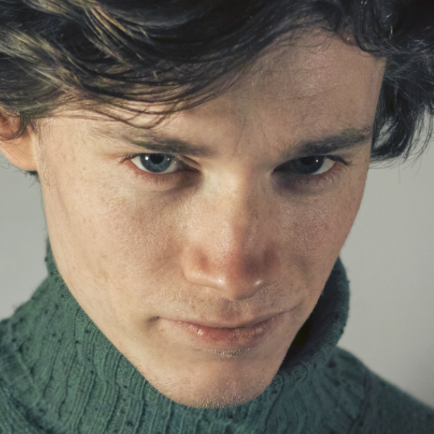

## About Me

Hi, I'm Felix. I studied Computer Science B.Sc in Jena, Germany. I'm very interested in social or innovative games. I want to create software goods that bond people.

Here are some of my projects.

## Projects

### 🌮 Recipe Network
A recipe shareing Resource for Friends and Family. 
[https://recipe.runningwhale.de](https://recipe.runningwhale.de) 

### Help Jack finally fulfill his Role as Caretaker
Play this cool game where you get to kill a boy with an axe. Find your way through a mythological maze and stand the freezing cold of the Colorado winter. Shine in the role as Jack and help him finally carry out his duty as a good Caretaker.

A game I created with my brother.
Published for Free on [itch.io](https://funwithaxes.itch.io/help-jack-finally-fulfill-his-role-as-caretaker) 

## Publication
During my Bachelor I occupied myself a lot with mechanics of F2P-games. I wrote a small article abut F2P anti-patterns in the [FifF 2/2017](https://www.fiff.de/publikationen/fiff-kommunikation/fk-2017/fk-2017-2)

## Contact
# [🐦](https://twitter.com/reiskeksultd) [🐙](https://github.com/thereiskeks) [👔](https://www.linkedin.com/in/felix-baral-a3453a146/)
