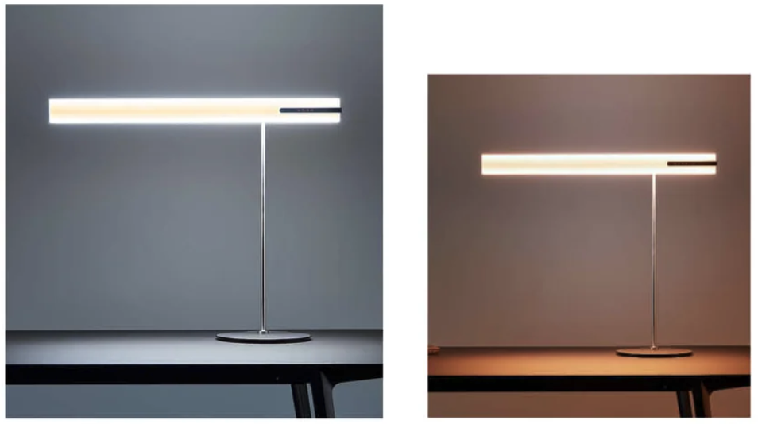

## About Me

Hi, I'm Felix. I grew up in Tübingen, then studied Computer Science B.Sc in Jena, Germany. I'm interested in all kinds of social and innovative apps and games. I find there to be a huge untapped well of social potential left in them. **I have set myself the goal to dig some of it up.**

Here are some of my projects.

## Projects and Experiences

### 💡 Apps for HEAVN GmbH

[HEAVN](https://heavn-lights.com) builds human centric luminaires. I build their Apps for Android and iOS. The Apps are native, with a kotlin native core, and communicate with Bluetooth Low Energy with the luminaire. I also build their firmwares in C and C++ on using the Zephyr RTOS.

<video autoplay controls loop width="120pt">
  <source type="video/mp4" src="ressources/heavn_small.mp4">
</video>

### 🎾⚽️🏐 Games and Infrastructure at Fun With Balls GmbH

Fun with Balls is a [exergames](https://en.wikipedia.org/wiki/Exergaming) startup in Munich. I've built a lot of games for them and helped them build infrastructure.  

[Read more ...](fun_with_balls)

### 🌮 Recipe Network

A recipe shareing Resource for Friends and Family. 
[https://recipe.runningwhale.de](https://recipe.runningwhale.de)

### Help Jack finally fulfill his Role as Caretaker
Play this cool game where you get to kill a boy with an axe. Find your way through a mythological maze and stand the freezing cold of the Colorado winter. Shine in the role as Jack and help him finally carry out his duty as a good Caretaker.

A game I created with my [brother](https://twitter.com/valentinbaral).
Published for Free on [itch.io](https://funwithaxes.itch.io/help-jack-finally-fulfill-his-role-as-caretaker) 

## Publication

During my Bachelor I occupied myself a lot with mechanics of F2P-games. I wrote a small article abut F2P anti-patterns in the [FifF 2/2017](https://www.fiff.de/publikationen/fiff-kommunikation/fk-2017/fk-2017-2).

## Contact
- 💌 felixbaral@me.com
- 📞 +49 151 26105883
- [🐙 Github](https://github.com/felixbaral) 
- [👔 LinkedIn](https://www.linkedin.com/in/felix-baral-a3453a146/) 
- [🐦 Twitter](https://twitter.com/reiskeksultd) 

 
 

